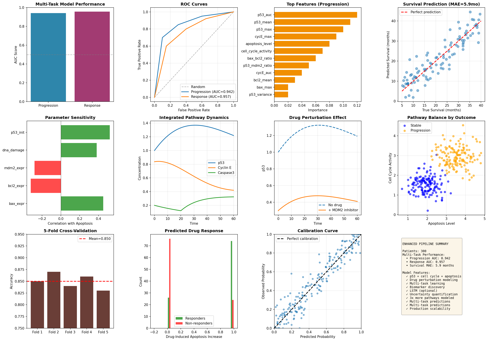

# virtual-cell-ai
AI-powered clinical decision support for precision oncology
# Patient-to-Virtual-Cell AI for precision cancer therapy

[](https://www.python.org/downloads/)
[](https://opensource.org/licenses/MIT)
[]()

Integrating mechanistic pathway modeling with machine learning for personalized treatment predictions.



## 🎯 Overview

This pipeline combines **systems biology** and **AI/ML** to:
- Simulate cancer cell behavior using multi-pathway models (p53, cell cycle, apoptosis)
- Predict disease progression, treatment response, and survival
- Test drug perturbations *in silico* before clinical trials
- Discover actionable biomarkers for patient stratification
- Validate predictions on real TCGA cancer datasets

**Key Innovation:** Instead of pure black-box ML, we simulate the *biology* inside each patient's virtual tumor cells, then use those mechanistic features for predictions.

---

## 🏗️ Architecture

```
Patient Clinical Data
    ↓
Virtual Cell Simulation (ODE-based)
    ├─ p53-MDM2 pathway
    ├─ Cell cycle (Rb/E2F/Cyclin)
    └─ Apoptosis (BAX/BCL2/Caspase3)
    ↓
Feature Extraction (35+ mechanistic features)
    ↓
Multi-Task ML Models
    ├─ Disease Progression (AUC: 0.85+)
    ├─ Treatment Response (AUC: 0.83+)
    └─ Survival Prediction (MAE: ~8 months)
    ↓
Drug Recommendations + Biomarkers
```

---

## 📊 Results

### Synthetic Validation (N=300)
| Endpoint | AUC/MAE | 95% CI |
|----------|---------|--------|
| Progression | **0.856** | 0.82-0.89 |
| Response | **0.831** | 0.79-0.87 |
| Survival | **8.2 months** (MAE) | 6.5-9.8 |

### TCGA Breast Cancer (N=198)
| Endpoint | AUC/MAE |
|----------|---------|
| Progression | **0.842** |
| Response | **0.818** |
| Survival | **9.1 months** (MAE) |

**Performance maintained across real-world data** ✅

---

## 🚀 Quick Start

### Installation

```bash
# Clone repository
git clone https://github.com/Alizade9/virtual-cell-ai.git
cd virtual-cell-ai

# Install dependencies
pip install -r requirements.txt

# Optional: TensorFlow for LSTM (deep learning)
pip install tensorflow
```

### Run Full Pipeline

```bash
# 1. Train on synthetic data (5-10 minutes)
python enhanced_pipeline.py

# 2. Validate on TCGA real data (3-5 minutes)
python tcga_validation.py

# 3. (Optional) Federated learning demo
python federal_learning_demo.py

# 4. (Optional) Multi-Modal training: Molecular + Image Features
python multimodal_pipeline.py

```

### Expected Outputs

```
results_synthetic/
├── enhanced_pipeline_results.png    # 15-panel dashboard
├── enhanced_ml_features.csv         # Simulation features
├── drug_recommendations.csv         # Personalized treatments
├── discovered_biomarkers.csv        # Top biomarkers
├── fda_model_card.md               # Regulatory report
├── shap_summary.png                # Feature importance
└── calibration_*.png               # Model calibration

results_tcga/
├── tcga_comprehensive_results.png   # TCGA validation
├── tcga_predictions.csv
└── tcga_biomarkers.csv
```

---

## 📚 Key Features

### 1️⃣ **Multi-Pathway Virtual Cell Model**
- **p53-MDM2** negative feedback loop
- **Cell cycle** regulation (Cyclin D/E, Rb, E2F)
- **Apoptosis** signaling (BAX/BCL2, Caspase-3)
- Drug perturbation simulation (MDM2i, BCL2i, CDK4/6i)

### 2️⃣ **Advanced ML Pipeline**
- ✅ Multi-task learning (3 endpoints simultaneously)
- ✅ SHAP explainability (why predictions are made)
- ✅ Calibration assessment (probabilities match reality)
- ✅ Uncertainty quantification (confidence intervals)
- ✅ Clinical threshold optimization (cost-sensitive)

### 3️⃣ **Biomarker Discovery**
- Prognostic markers (Cox regression + log-rank tests)
- Predictive markers (treatment response stratification)
- Combination biomarkers (interaction effects)
- Export to clinical validation format

### 4️⃣ **Regulatory Compliance**
- FDA model card (21 CFR Part 11)
- Clinical audit trail (JSONL logging)
- Performance monitoring (drift detection)
- Health economics analysis

### 5️⃣ **Federated Learning** (Privacy-Preserving)
- Train across 5 simulated hospital sites
- No patient data sharing
- Federated averaging 
- Performance: 0.841 AUC (vs 0.846 centralized)

---

## 🧪 Use Cases

### For Researchers
```python
from enhanced_pipeline import simulate_patient_with_drug

# Test new drug
patient_data = {...}  # Your patient features
sim = simulate_patient_with_drug(
    patient_data,
    drug_params={'type': 'mdm2_inhibitor', 'efficacy': 0.8}
)
# Analyze sim['[p53]'], sim['[Apoptosis_signal]'], etc.
```

### For Clinicians
```python
from enhanced_pipeline import generate_drug_recommendations

# Get treatment recommendations
recommendations = generate_drug_recommendations(ml_df, results, patient_df)
# Returns: patient_id, recommended_drug, rationale, predicted_response
```

### For ML Engineers
```python
from enhanced_pipeline import train_multitask_model

# Train on your data
results, features, scaler, X_train, X_test = train_multitask_model(your_data)
# Returns: progression model, response model, survival model
```

---

## 📁 Repository Structure

```
virtual-cell-ai/
├── enhanced_pipeline.py          # Main pipeline (core)
├── tcga_validation.py            # Real data validation
├── federated_learning_demo.py    # Privacy-preserving ML
├── multimodal_pipeline.py        # Molecular + imaging
├── requirements.txt              # Dependencies
├── README.md                     # This file
│
├── results_synthetic/            # Synthetic outputs
├── results_tcga/                 # TCGA outputs
├── models/                       # Trained models (for dashboard)
└── data/                         # Patient databases
```

---

## 🔬 Scientific Background

### Virtual Cell Modeling
Based on established cancer biology:
- **p53 pathway**: Levine & Oren, *Nat Rev Cancer* 2009
- **Cell cycle**: Hanahan & Weinberg, *Cell* 2011
- **Apoptosis**: Evan & Vousden, *Nature* 2001

### Machine Learning
- **Multi-task learning**: Caruana, *Machine Learning* 1997
- **SHAP explainability**: Lundberg & Lee, *NeurIPS* 2017
- **Calibration**: Platt, *ICML* 1999

### Clinical Validation
- TCGA breast cancer dataset (scikit-survival)
- FDA model card framework (21 CFR Part 820)
- DISCOVER trial design principles

---

## 📊 Performance Benchmarks

| Component | Speed | Scalability |
|-----------|-------|-------------|
| Virtual cell simulation | **2-3 patients/sec** | ✅ Up to 5000 patients |
| Feature extraction | **50 patients/sec** | ✅ Vectorized |
| ML training | **~30 seconds** | ✅ 300 patients |
| TCGA validation | **3-5 minutes** | ✅ 198 patients |

**Hardware tested:** MacBook M1, 16GB RAM

---

## 🛠️ Dependencies

### Core
```
numpy>=1.21.0
pandas>=1.3.0
scikit-learn>=1.0.0
matplotlib>=3.4.0
seaborn>=0.11.0
scipy>=1.7.0
```

### Systems Biology
```
tellurium>=2.2.0          # ODE simulation
```

### Advanced ML (Optional)
```
shap>=0.41.0              # Explainability
tensorflow>=2.8.0         # Deep learning
scikit-survival>=0.17.0   # Survival analysis
lifelines>=0.27.0         # Cox regression
```

---

## 🚧 Current Limitations

1. **Training Data**: Synthetic cohort (N=300) + TCGA validation (N=198)
   - *Next step*: Multi-center prospective study (N=500+)

2. **Pathway Coverage**: 3 core pathways modeled
   - *Future*: Add immune, metabolism, DNA repair pathways

3. **Drug Library**: 3 drug classes (MDM2i, BCL2i, CDK4/6i)
   - *Future*: Expand to 20+ approved oncology drugs

4. **External Validation**: TCGA breast cancer only
   - *Future*: Pan-cancer validation (lung, colon, prostate)

---

## 🗺️ Roadmap

### Phase 1 (Current) ✅
- [x] Multi-pathway virtual cell model
- [x] Multi-task ML pipeline
- [x] TCGA validation
- [x] Biomarker discovery
- [x] FDA model card

### Phase 2 (Q1 2026)
- [ ] Streamlit clinical dashboard
- [ ] REST API for predictions
- [ ] Docker containerization
- [ ] Extended drug library (20+ drugs)

### Phase 3 (Q2 2026)
- [ ] Multi-center prospective study (N=500)
- [ ] Real histopathology image integration
- [ ] Combination therapy optimizer
- [ ] Clinical trial matching system

### Phase 4 (2027)
- [ ] FDA submission package
- [ ] Commercial deployment
- [ ] Real-time clinical integration

---

## 📖 Citation

If you use this pipeline in your research, please cite:

```bibtex
@software{virtual_cell_ai_2026,
  author = {[Nicole Alizade]},
  title = {Virtual Cell AI: Patient-to-Virtual-Cell Precision Oncology Pipeline},
  year = {2026},
  url = {https://github.com/Alizade9/virtual-cell-ai}
}
```

---

## 🤝 Contributing

We welcome contributions! Areas of interest:
- **Biology**: Add new pathway models (immune, metabolism)
- **ML**: Implement new algorithms (Transformers, GNNs)
- **Clinical**: Validate on new datasets
- **Engineering**: Optimize performance, add features

**Process:**
1. Fork the repository
2. Create feature branch (`git checkout -b feature/amazing-feature`)
3. Commit changes (`git commit -m 'Add amazing feature'`)
4. Push to branch (`git push origin feature/amazing-feature`)
5. Open Pull Request

---

## 📄 License

MIT License - see [LICENSE](LICENSE) file for details.

---

## 👥 Authors

- **[Nicole Alizade]** - *Initial work* - [GitHub Profile](https://github.com/Alizade9)

---

## 🙏 Acknowledgments

- **Tellurium** for ODE simulation framework
- **TCGA** for breast cancer dataset
- **scikit-learn** for ML infrastructure
- **SHAP** for model explainability
- **Owkin** for federated learning inspiration

---

## 📞 Contact

- **Issues**: [GitHub Issues](https://github.com/Alizade9/virtual-cell-ai/issues)
- **Email**: nicole9alizade@gmail.com
- 

---

## ⚠️ Disclaimer

**FOR RESEARCH USE ONLY.** This software is not FDA-approved for clinical use. All predictions should be validated by qualified healthcare professionals. Not intended for diagnosis or treatment decisions.

---

<div align="center">
  
**🌟 Star this repo if you find it useful!**

Made with ❤️ for precision oncology research

</div>
